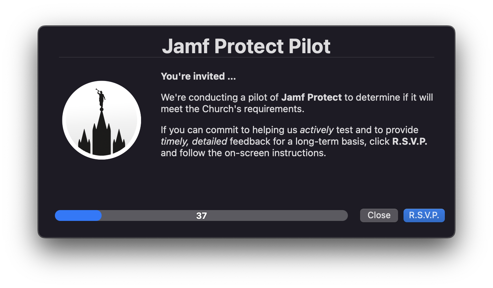

# Invitation-only Betas
As a follow-up to [Your Internal Beta Test Program: Opt-in, Opt-out via Self Service,](https://github.com/dan-snelson/Internal-Beta-Test-Program/blob/master/README.md) learn how to architect invitation-only betas for your elite testers for when your organization pilots new endpoint security solutions, like [Jamf Protect](https://www.jamf.com/products/jamf-protect/), while maintaining your current offerings.

---

Please see the [Wiki](https://github.com/dan-snelson/Invitation-only-Betas/wiki) to learn about configuring an invitation-only beta.

All support for this workflow should be asked by opening an [issue](https://github.com/dan-snelson/Invitation-only-Betas/issues).