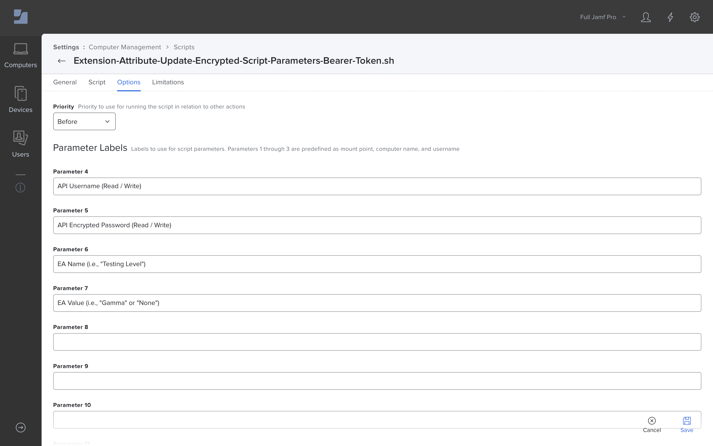

# Invitation-only Betas
## Scripts

- [Property List Writer](#property-list-writer)
- [Extension Attribute Update (Encrypted Script Parameters)](#extension-attribute-update-encrypted-script-parameters)

---

### Property List Writer

> Leverages Jamf Pro Script Parameters to write a given `string` to the specified `key` in a hard-coded `filepath`.

#### Configuration

1. Download [Property-List-Writer.sh](Property-List-Writer.sh)
1. [Add](https://docs.jamf.com/10.37.0/jamf-pro/documentation/Scripts.html?hl=scripts#ID-000234ed) the downloaded Script to Jamf Pro
1. Modify `filepath` to match the **Reverse Domain Name Notation** for your organization (i.e., `org.churchofjesuschrist`)
1. Click the **Options** tab and configure the Parameter Labels as follows:
	- Parameter 4: `Key (i.e., Name of the "key" for which the value will be set)`
	- Parameter 5: `Value (i.e., The value to which "key" will be set)`
1. Click **Save**

(Use [Extension Attributes](https://github.com/dan-snelson/Invitation-only-Betas/tree/main/ExtensionAttributes) to read the results.)

---

### Extension Attribute Update (Encrypted Script Parameters)

> Set a computer's Extension Attribute via the Jamf Pro API.
> 
> :warning:  **Warning:** Requires global-scope API credentials on clients; provides obfuscation at-best.

#### Configuration

1. Download one of the following:
	- [Extension-Attribute-Update-Encrypted-Script-Parameters.sh](Extension-Attribute-Update-Encrypted-Script-Parameters.sh)
	- [Extension-Attribute-Update-Encrypted-Script-Parameters-Bearer-Token.sh](Extension-Attribute-Update-Encrypted-Script-Parameters-Bearer-Token.sh)
1. [Add](https://docs.jamf.com/10.37.0/jamf-pro/documentation/Scripts.html?hl=scripts#ID-000234ed) the downloaded Script to Jamf Pro
1. Modify `Salt` and `Passphrase` per [Encrypted Strings](https://github.com/brysontyrrell/EncryptedStrings)
1. Click the **Options** tab and configure the Parameter Labels as follows:
	- Parameter 4: `API Username (Read / Write)`
	- Parameter 5: `API Encrypted Password (Read / Write)`
	- Parameter 6: `EA Name (i.e., "Testing Level")`
	- Parameter 7: `EA Value (i.e., "Gamma" or "None")`
1. Click **Save**

##### Additional Resources
- [Your Internal Beta Test Program: Opt-in / Opt-out via Self Service](https://github.com/dan-snelson/Internal-Beta-Test-Program/blob/master/README.md).